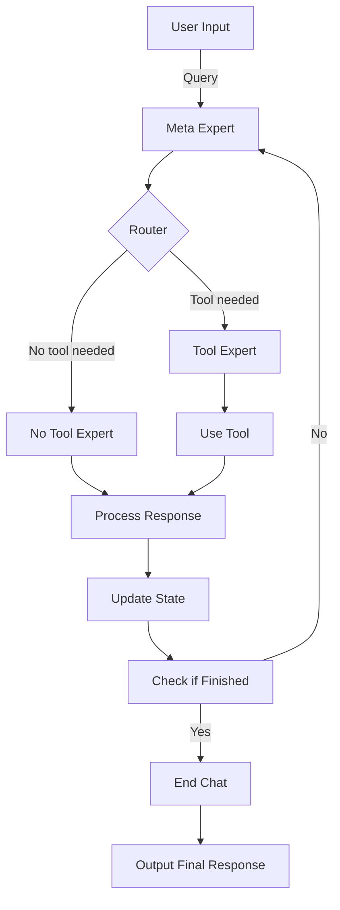

# Meta Expert

An implmentation of the meta agent prompt engineering framework.

Paper on **Meta-Prompting** [source](https://arxiv.black/pdf/2401.12954)

### Prerequisites

#### Environment Setup

1. **Install Anaconda:**Download Anaconda from [https://www.anaconda.com/](https://www.anaconda.com/).
2. **Create a Virtual Environment:**

   ```bash
   conda create -n agent_env python=3.11 pip
   ```
3. **Activate the Virtual Environment:**

   ```bash
   conda activate agent_env
   ```

### Clone and Navigate to the Repository

1. **Clone the Repo:**

   ```bash
   git clone https://github.com/flight505/meta_expert.git
   ```
2. **Navigate to the Repo:**

   ```bash
   cd /path/to/your-repo/meta_expert
   ```
3. **Install Requirements:**

   ```bash
   pip install -r requirements.txt
   ```

### Configure API Keys

1. **Open the `config.yaml`:**

   ```bash
   nano config.yaml
   ```
2. **Enter API Keys:**

   - **Serper API Key:** Get it from [https://serper.dev/](https://serper.dev/)
   - **OpenAI API Key:** Get it from [https://openai.com/](https://openai.com/)
   - **Gemini API Key:** Get it from [https://ai.google.dev/gemini-api](https://ai.google.dev/gemini-api)
   - **Claude API Key:** Get it from [https://docs.anthropic.com/en/api/getting-started](https://docs.anthropic.com/en/api/getting-started)
   - **Groq API Key:** Get it from [https://console.groq.com/keys](https://console.groq.com/keys)

### Run Your Query In Shell

```bash
python -m agents.meta_agent
```

Then enter your query.

### System Architecture Overview

The Meta Expert system is designed to interact with users, process their queries, and utilize different experts and tools to generate comprehensive responses. Below is a flowchart that visualizes the system's structure:




### Setup Ollama Server

1. **Download Ollama:**
   Download [https://ollama.com/download](https://ollama.com/download)
2. **Download an Ollama Model:**

   ```bash
   curl http://localhost:11434/api/pull -d "{\"name\": \"llama3\"}"
   ```

Ollama [API documentation](https://github.com/ollama/ollama/blob/main/docs/api.md#list-local-models)
